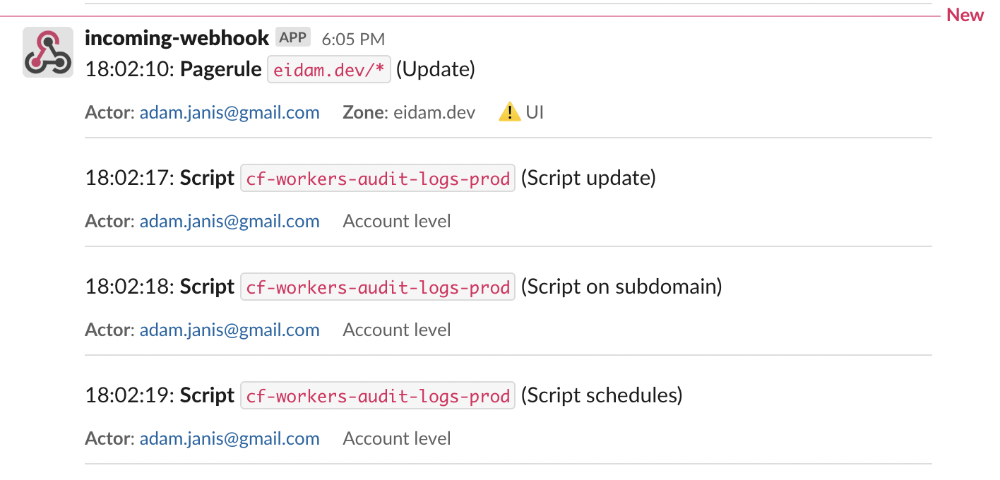

# Cloudflare Worker - Audit Logs

A Cloudflare Worker using KV and CRON trigger for checking and sending Audit Logs to Slack. Using **Cloudflare Workers**, **CRON Triggers,** and **KV storage**. 🚀



## Pre-requisites

You'll need a [Cloudflare Workers account](https://dash.cloudflare.com/sign-up/workers) _(Free Tier is enough)_

Prepare the following secrets

- Cloudflare API token with `Account Logs:Read` and `Account Settings:Read` permissions _(yes, both needed)_
- Slack incoming webhook

## Deploy with Cloudflare Deploy Button

[](https://deploy.workers.cloudflare.com/?url=https://github.com/eidam/cf-workers-audit-logs)

1. Click the button and follow the instructions, you should end up with a clone of this repository
2. Navigate to your new **GitHub repository &gt; Settings &gt; Secrets** and add the following secrets:

   ```yaml
   - Name: CF_API_TOKEN (should be added automatically)

   - Name: CF_ACCOUNT_ID (should be added automatically)

   - Name: SECRET_CLOUDFLARE_API_TOKEN
   - Value: your-read-cloudflare-api-token

   - Name: SECRET_SLACK_WEBHOOK_URL
   - Value: your-slack-webhook-url
   ```

3. Navigate to the **Actions** settings in your repository and enable them
4. Trigger last GitHub action (or rerun failed) to deploy Workers 🎉

## Known issues

- **Max 10 message blocks in Slack**.

  It just might take a while to catch up with all the audit logs from a current day once you deploy the Worker.
